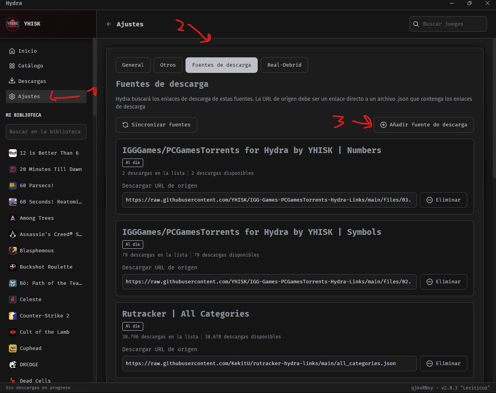
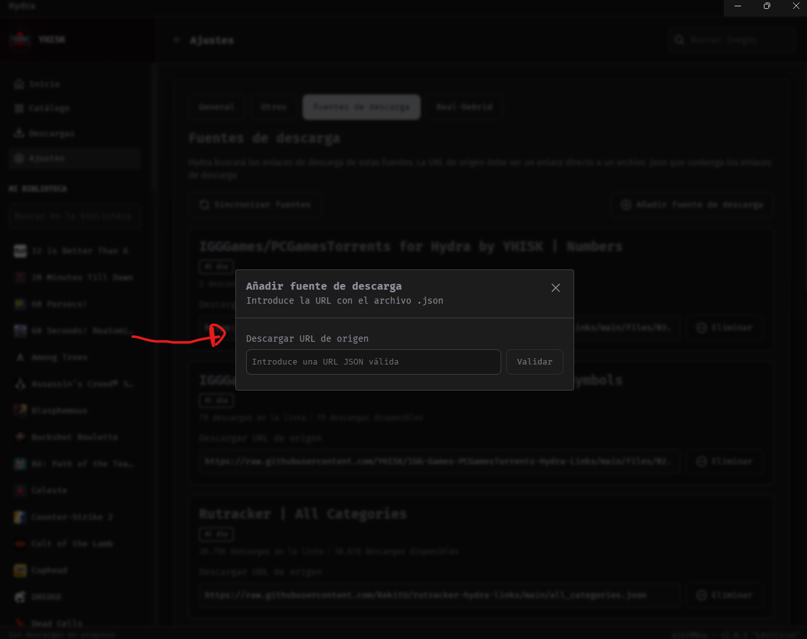

Ver en https://yhisk.github.io/IGG-Games-PCGamesTorrents-Hydra-Links/

# IGG-Games-PCGamesTorrents-Hydra-Links
## Presentación/Presentation/Apresentação
### Español
Este repositorio es únicamente para colectar en un mismo lugar todos (o por lo menos la mayoría) de los links proporcionados por la pagina IGG-Games/PCGamesTorrent para poder ser utilizados en el Programa Hydra para PC. Yo no pirateo juegos, únicamente busco links de otras fuentes para ponerlos en un único documento para su fácil utilización. Absténgase de cualquier pedido pues no será tomado en cuenta.
### English
This repository is only to collect in one place all (or at least most) of the links provided by the IGG-Games/PCGamesTorrent page to be used in the Hydra Program for PC. I don't pirate games, I just look for links from other sources to put them in a single document for easy use. Please refrain from any request as it will not be taken into account.
### Português do Brasil
Este repositório serve apenas para reunir em um único local todos (ou pelo menos a maioria) dos links fornecidos pelo site IGG-Games/PCGamesTorrent para uso no programa Hydra PC. Eu não pirateio jogos, apenas procuro links de outras fontes para colocá-los em um único documento para facilitar o uso. Por favor, evite fazer qualquer solicitação, pois ela não será levada em consideração.

## ¿Qué es PCGamesTorrents?/What is PCGamesTorrents?/O que é PCGamesTorrents?
### IGG-Games

### PCGamesTorrents

### Español
Como se puede apreciar, las páginas son lo mismo. Desconozco si son del mismo dueño, pero en el apartado estético y la interfaz son exactamente iguales. La diferencia radica en que IGG-Games presenta links para juegos a través de sitios de descarga externos, mientras que, PCGamesTorrents presenta links para los mismos juegos pero única y exclusivamente por Torrents. Después de eso son exactamente lo mismo
### English
As you can see, the pages are the same. I don't know if they are from the same owner, but in terms of aesthetics and interface they are exactly the same. The difference is that IGG-Games presents links to games through external download sites, while PCGamesTorrents presents links to the same games but only and exclusively through Torrents. After that they are exactly the same
### Português do Brasil
Como você pode ver, as páginas são as mesmas. Não sei se são do mesmo proprietário, mas em termos de estética e interface são exatamente iguais. A diferença é que o IGG-Games apresenta links para jogos por meio de sites de download externos, enquanto o PCGamesTorrents apresenta links para os mesmos jogos, mas única e exclusivamente por meio de Torrents. Depois disso, eles são exatamente iguais

## ¿Como se Utiliza?/How is it used?/Como ele é usado?
### Español
Para agregar una fuente de descarga a Hydra hay 2 opciones:
1. Ir a Ajustes → Fuentes de Descarga → Añadir Fuentes y pega el link de la fuente que desea agregar
### English
To add a download source to Hydra there are 2 options:
1. Go to Settings → Download Fonts → Add Fonts and paste the link of the font you want to add 2.
### Português do Brasil
Para adicionar uma fonte de download ao Hydra, há duas opções:
1. vá para Settings → Download Fonts → Add Fonts e cole o link da fonte que você deseja adicionar.

### Español
2. Puede ir a [lista de enlaces](https://github.com/YHISK/IGG-Games-PCGamesTorrents-Hydra-Links?tab=readme-ov-file#lista-de-enlaceslist-of-linkslista-de-links) (mas abajo en este mismo repositorio) y darle click al enlace de la lista que desee agregar. Tambien puede darle click a la lista "All" para agregar todos los enlaces de una sola vez
### English
2. You can go to the [list of links](https://github.com/YHISK/IGG-Games-PCGamesTorrents-Hydra-Links?tab=readme-ov-file#lista-de-enlaceslist-of-linkslista-de-links) (below in this repository) and click on the link in the list you want to add. You can also click on the “All” list to add all the links at once.
### Português do Brasil
2. Você pode ir até a [lista de links](https://github.com/YHISK/IGG-Games-PCGamesTorrents-Hydra-Links?tab=readme-ov-file#lista-de-enlaceslist-of-linkslista-de-links) (abaixo neste repositório) e clicar no link da lista que deseja adicionar. Você também pode clicar na lista “All” para adicionar todos os links de uma só vez.

## Lista de Enlaces/List of Links/lista de links
### ✅ Completo/Complete/Completo | ⚠ Trabajando/Working/Trabalhando | ❌ Vacio/Empty/Vácuo

[All](hydralauncher://install-source?urls=https://raw.githubusercontent.com/YHISK/IGG-Games-PCGamesTorrents-Hydra-Links/main/files/01.%20PCGameTorrents%20-%20All.json) - ⚠

[Symbols](hydralauncher://install-source?urls=https://raw.githubusercontent.com/YHISK/IGG-Games-PCGamesTorrents-Hydra-Links/main/files/02.%20PCGameTorrents%20-%20Symbols.json) - ✅ "(not all, but 80% yes)"

[Numbers](hydralauncher://install-source?urls=https://raw.githubusercontent.com/YHISK/IGG-Games-PCGamesTorrents-Hydra-Links/main/files/03.%20PCGameTorrents%20-%20Numbers.json) - ⚠
